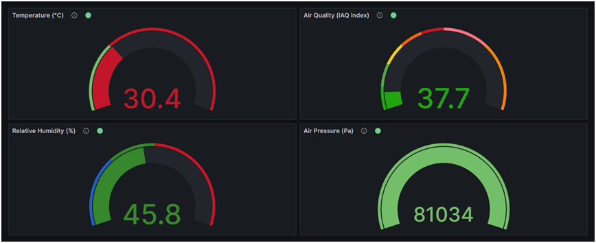

# RAK4630 USB MQTT Data Display Project

This project showcases the integration of RAK4630, USB communication, MQTT protocol, and Grafana for real-time data display. The RAK4630 reads data from the RAK1906 module and transmits it over USB serial to a Java application. The Java application publishes this data to an MQTT broker. Grafana subscribes to the MQTT broker and displays the data in four gauges representing temperature, air quality, humidity, and air pressure.

## Components

- **RAK4630**: LoRaWAN module capable of reading data from the RAK1906 module and transmitting it over USB serial.
- **RAK1906**: Sensor module providing data for temperature, air quality, humidity, and air pressure.
- **USB Serial Communication**: Communication interface used to transmit data from RAK4630 to the Java application.
- **Java Application**: Collects data from RAK4630 over USB serial, publishes it to an MQTT broker, and acts as a bridge between RAK4630 and the MQTT broker.
- **MQTT Broker**: Implemented using the Moquette Java package, responsible for receiving data from the Java application and forwarding it to subscribers.
- **Grafana**: Data visualization tool used to display real-time data from the MQTT broker in four gauges.

## Project Structure

- **RAK4630 Arduino Script**: The Arduino script for the RAK4630 module can be found in the [RAK4630_Arduino](RAK4630_Arduino) folder of this repository.
- **Java Application**: The Java application was developed using NetBeans and Maven. The code is located in the [RAK4630_MQTT](RAK4630_MQTT) folder.
- **Grafana Dashboard JSON Model**: The JSON model for the Grafana dashboard can be found in the [Grafana-RAK4630-Dashboard-JSON-Model](Grafana-RAK4630-Dashboard-JSON-Model) folder.
- **Grafana Dashboard Image**: The image displayed in this README has the name `rak4630-grafana.png` and is located in the [images](images) folder of this repository.

## Setup

1. Connect the RAK4630 and RAK1906 modules appropriately.
2. Compile and load the Arduino script into the RAK4630 module.
3. Build the java application using Netbeans and run the resulting jar file.
4. Install and set up Grafana to subscribe to the MQTT broker and display the data in gauges.
5. MQTT and Grafana were made to run on localhost to simplify the project.

## Usage

1. Ensure all components are properly connected and configured.
2. Start the Java application to read data from RAK4630 and publish it to the MQTT broker.
3. Launch Grafana and set up the dashboard to subscribe to the MQTT broker and display the real-time data.

## License

This project is licensed under the [MIT License](LICENSE).

For detailed information on the project, refer to the [documentation](docs/README.md).
